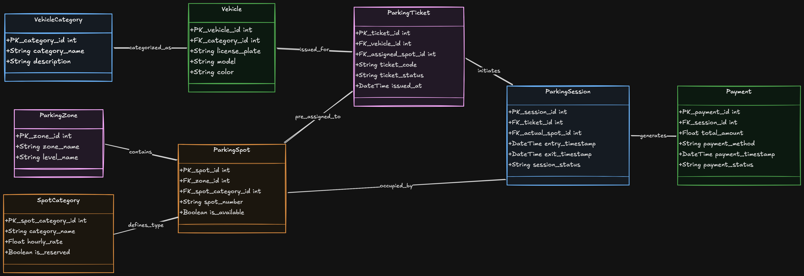

# Parking Management System — ER Diagram

A complete Entity-Relationship diagram designed for a parking management
and ticketing platform.

## Overview

This diagram models the full database structure of a parking system
that supports:

- Categorizing vehicles by type
- Assigning vehicles to parking spots through ticketing
- Organizing spots across zones and levels
- Tracking real-time parking sessions with entry and exit timestamps
- Handling payments generated from completed sessions

## Entities

- **VehicleCategory** — Stores category types for classifying vehicles
- **Vehicle** — Stores vehicle details including license plate, model, and color, linked to a category
- **ParkingZone** — Represents a named zone with a level designation within the facility
- **SpotCategory** — Defines spot types with hourly rates and reservation flags
- **ParkingSpot** — Represents individual spots linked to a zone and a spot category with availability tracking
- **ParkingTicket** — Issued for a vehicle and pre-assigned to a spot, carrying a ticket code and status
- **ParkingSession** — Represents the actual parking activity initiated by a ticket, tracking entry/exit timestamps and the actual spot used
- **Payment** — Billing record generated from a session, storing amount, method, and payment status

## Key Design Decisions

- ParkingTicket and ParkingSession are modeled as separate entities because
a ticket is issued at entry but the session only exists once the vehicle
is actively parked
- The relationship between ParkingTicket and ParkingSession is labeled
"initiates" to reflect that a session begins from a valid ticket
- ParkingSession holds FK_actual_spot_id separately from the ticket's
FK_assigned_spot_id to account for cases where the actual spot used
differs from the one pre-assigned
- SpotCategory is a separate entity rather than a plain attribute on
ParkingSpot to keep hourly rate and reservation logic properly normalized
- ParkingZone captures both zone name and level name, supporting
multi-level parking facilities without a separate Level entity
- Boolean is_available on ParkingSpot allows real-time availability
queries without scanning session records
- Boolean is_reserved on SpotCategory allows the system to distinguish
between general and reserved spot types at the category level

## Diagram

## Tools Used

- Designed using [Eraser.io](https://eraser.io)
